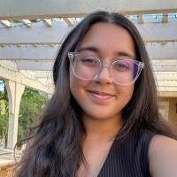
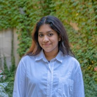
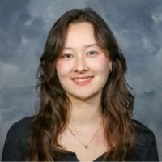

This website is a group project for Data 25900. We made it during Fall 2025. We hope that you learned something about genetic editing, and that it sticks with you if you are ever in the position to choose whether or not to edit traits in your children (born or unborn). 
 

  

    
    
Manya Lalwani

  

  

    
    
Sneha Agarwal

  

  

    
    
Sarah Whitney

  

 
