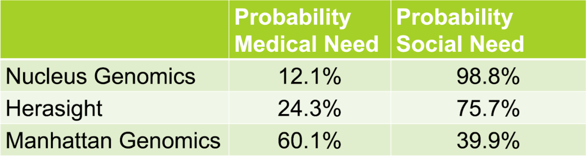

## Introduction

As discussed in our home pages the majority of ethical discourse on germline editing is specific to use cases and how the tool can be employed safely. It is evident from the arguments presented earlier that the tool has the potential to bring about a great deal of benefit in healthcare and be a therapeutic tool for diseases where there are no other options however skepticism arises when the tool is misapplied for “self-fulfilling” purposes like enhancement (Pew Research Center, 2022). We wanted to make sure that prospective parents are aware of the ethics and can make an informed decision when choosing different gene editing service providers to make sure that their values and ethics align with those of the company. The model we built allows prospective users of germline editing to “vet” their gene editing provider of choice based on their outlook on germline editing as a “medical need” or a “social need”. 

## Our Model

### How it Works

The aim of our ML model was to classify text on the websites of genetic editing/IVF screening companies as a Medical Need or a Social Need, indicating whether these companies viewed these methods as a solution to medical problems or to social ones. The base of the model is roBERTa-base, which we chose to use because of its small size and relative success with small training datasets. The model was finetuned on a dataset of 400 entries total, and a training-testing split of 80-20. 3 epochs were used with a learning rate of 2e-5. The model is uploaded to HuggingFace at https://huggingface.co/mlalwani2004/designer-baby-text-classification. 

### How to Use It

  

To use the model, simply run the set up cells and then based on whether your input is a single sentence or many paragraphs, enter your section of sentences into the appropriate block. The model will return the probability of the text portraying reproductive technologies as a medical need or a social need. These proportions represent, in oversimplified words, how similar the text entered is to texts classified by us as “medical need” or “social need”. Therefore, it is important to consider the criteria we used to classify things as described below. When using the tool, make sure to ask yourself whether the companies you are screening align with your own ethics and values. Additionally, make sure to ask yourself about the author(s) of the material, who the stakeholders are and whether they are implicated in biasing your decisions. These questions will likely help in understanding the probabilities outputted by the model. For instance, if the text you input is from a scientist who is working on the transhumanist mission and wants to harness the tool for enhancement purposes, the authorship and their stakes would influence the sentiments in their marketing. Whether you are someone simply interested in the ethics of gene editing or a prospective parent, you can use the tool to find service providers who best align with your views on the topic. If you are someone who is curious about public outlook on the topic then this tool will also be very helpful in making connections between stakeholders and the opinions they are most likely to propagate.

### Model Training

The model is trained on a dataset we put together ourselves. If you want to know where the entries on our dataset, which will be regularly updated, came from, we recommend you check the below document. Additionally, if you are curious about how we classified things in our dataset as medical need or social need, check our peer-reviewed set of criteria below.

[View Criteria](https://docs.google.com/document/d/17ebrzU6WOhoOXMozlPmX15n7iNMFYSVjjMYymNoLw2M/edit?usp=sharing)

## Results from Using the Model on Ethics Statements from Genetic Editing/IVF Screening Companies

Table 1: Sentiment analysis on the ethics statements from three reproductive technology providers. 

Three popular PGD-P and germline editing providers, Nucleus Genomics, Herasight and Manhattan Genomics, were searched for their ethics statements. For Herasight, we used the conclusion of their academic paper on the ethics of designer babies. For Nucleus Genomics, we used their founder and CEO’s ethics promise. For Manhattan Genomics, we used their explicit ethics statement. Based on this analysis in Table 1, it seems as though Nucleus Genomics and Herasight seem to treat the idea of PGD-P more as a social need that can help society and “mankind” advance while Manhattan Genomics is focused on the tool to prevent rare incurable diseases. 